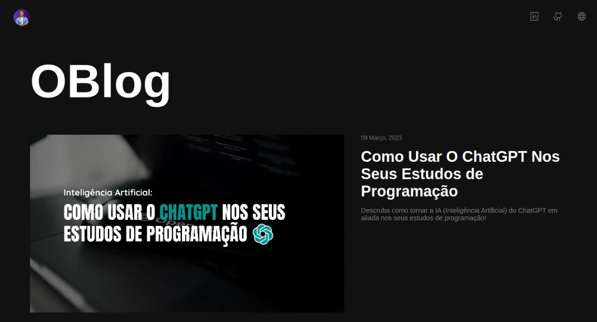

<h1 align="center">
    OBlog
</h1>

    Todos os meus artigos em um só lugar!

  <a href="#objetivo">Objetivo</a>&nbsp;&nbsp;&nbsp;|&nbsp;&nbsp;&nbsp;
  <a href="#tecnologias">Ferramentas</a>&nbsp;&nbsp;&nbsp;|&nbsp;&nbsp;&nbsp;
  <a href="#projeto">Projeto</a>&nbsp;&nbsp;&nbsp;|&nbsp;&nbsp;&nbsp;
  <a href="#layout">Layout</a>

  

  

<h2 id="objetivo">🚀 <b>Objetivo:</b></h2>

- Criar uma aplicação de blog funcional, construir componentes inteligentes e aprender como organizar um projeto Angular utilizando as ferramentas que o próprio Framework oferece.

<h2 id="tecnologias">🔧 <b>Ferramentas:</b></h2>

- [Angular](https://angular.io/) v16
- [TypeScript](https://www.typescriptlang.org/docs/handbook/release-notes/typescript-5-0.html) v5
- HTML e CSS
- Git e GitHub
- [Fontshare](https://www.fontshare.com/)
- [Phosphoricons](https://phosphoricons.com/)

<h2 id="projeto">💻 <b>Projeto:</b></h2>

- [Veja o projeto online](https://oblog.vercel.app/)

<h2 id="layout">🎨 <b>Layout:</b></h2>

- [Dwinawan | Blog - Personal Website](https://dribbble.com/shots/15238065-Blog-Personal-Website)

 

  Feito com 💜 por mim | Bruno Souza

